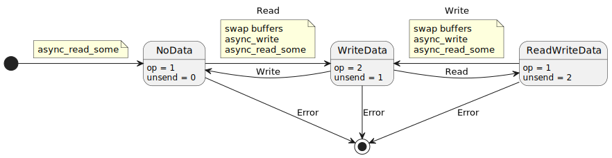
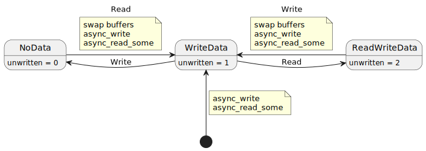

# Gor Nishanov CppCon2017 Coroutine examples

- [Stop1](#stop)
- [First](#first)
- [Easy](#easy)
- [Hard1](#hard1)
- [Hard2](#hard2)
- [Over1](#over1)
- [Over2](#over2)
- [Classic_client & classic_server](#classic_client--classic_server)
- [Client & server](#client--server)
  - [Classic server implementation](#classic-server-implementation)
  - [Classic client implementation](#classic-client-implementation)
  - [Client coroutine based implementation](#client-coroutine-based-implementation)
  - [Server coroutine based implementation](#server-coroutine-based-implementation)
  - [Performance comparisson](#performance-comparisson)


## [Stop1](./stop1.cpp)

It basically uses boost asio with several ancillary headers within:
- [`handler_allocator.hpp`](https://raw.githubusercontent.com/GorNishanov/await/refs/heads/master/2017_CppCon/live/handler_allocator.hpp) → quick and dirty allocator for handlers. Basically uses an
  `std::array<char, 1024>` as storage. `SimpleAllocator` will delegate in the global heap if the kb is not enough.
  `custom_alloc_handler` will wrap allocator (memory) and handler, simplifing the asio `async_xxx` methods usage.
  `custom_alloc_handler::get_allocator()` will return the actual allocator.
  Note that only read/write operations use allocator the others rely in the fact that the Awaiters are kept into the
  coroutine state and can be referenced in the callbacks (awaiter used as storage).

- [`future_adapter.h`](https://github.com/GorNishanov/await/blob/master/2017_CppCon/live/future_adapter.h) → defines
  `coroutine_traits<future<...>, ...>` as James McNellis taught in his [cppcon talk](https://youtu.be/ZTqHjjm86Bw)
  (see [future example](../basics/future/future.cpp)).

- [`await_adapters.h`](https://raw.githubusercontent.com/GorNishanov/await/refs/heads/master/2017_CppCon/live/await_adapters.h)
  → provides overrides of asio's `async_write()`, `async_read_some()`, `async_accept()` and `async_wait()` that
  rely in coroutines instead of callbacks. Basically the coroutine is resumed in the `io_context`
  loop when the async operation is completed. The callbacks are created via `custom_alloc_handlers` that wrap the
  allocator and a plain lambda handler. This way the handler keeps the memory where the arguments are stored
  simplifying the life of the programmer.

The actual example shows the `async_wait()` wrapper usage. The coroutine uses a future as result type profiting from
the [`future_adapter.h`](https://github.com/GorNishanov/await/blob/master/2017_CppCon/live/future_adapter.h) magic.
The example's coroutine is:
```c++
    std::future<void> noisy_clock(system_timer &timer) {
      try {
        for (;;) {
          co_await better_async_wait(timer, 1s);
          puts("tick");
          co_await better_async_wait(timer, 1s);
          puts("tock");
        }
      }
      catch (std::exception const& e) {
        std::cout << "caught: " << e.what() << "\n";
      }
    }
```

Note that because the function uses an infinite loop there is no return statement but a `future<void>` is returned in
the first `co_await` suspension using
```c++
    std::experimental::coroutine_traits<std::future<void>, Args...>::promise_type::get_return_object()
```
the other suspensions will take place into the `io_context` loop and no future will be retrieved.

Note it is using `better_async_wait` instead of the `async_wait()` provided by [`await_adapters.h`](https://raw.githubusercontent.com/GorNishanov/await/refs/heads/master/2017_CppCon/live/await_adapters.h).
That's because the `await_adapters.h` awaiters don't have exception handling. The `better_async_wait` uses a functor instead
of a lambda thus, the functor destructor can handle aborted operations: it will resume the coroutine assuring that
the `await_resume()` method will raise an exception. The coroutine will catch the exception and terminate itself.
```c++
    int main() {
      {
        io_context io;
        system_timer timer(io);
        auto f = noisy_clock(timer);
        system_timer fast_timer(io, 1s);
        fast_timer.async_wait([&](auto){io.stop();});
        io.run();
        puts("done");
      }
      puts("io_context destroyed");
    }
```
This example is devised to exemplify the exception handling. That's because the `fast_timer` callback will kill the asio
loop between coroutine suspensions. This effectively will:
- destroy the coroutine (exception is raised by the ad hoc awaiter).
- `io.run()` will return after `io.stop()` is processed (this time in the same thread).

### build issues

The build fails because Gor's code doesn't fulfill the
[`WaitHandler` requirement](https://live.boost.org/doc/libs/1_62_0/doc/html/boost_asio/reference/WaitHandler.html).
The documentation doesn't mention it but the handler must be copy constructible.

### execution

```powershell
> ./stop1.exe
    tick
    done
    caught: The I/O operation has been aborted because of either a thread exit or an application request.
    io_service destroyed
```

## [First](./first.cpp)

Plainly shows how to use a `coroutine_traits` specialization to use `std::future` and `std::promise` with coroutines as James
McNellis does in one of his [talks](https://youtu.be/ZTqHjjm86Bw). The approach is different because here the promise
is a member of `promise_type` instead of using inheritance. The McNellis is more generic providing tailor made
`return_value()` implementations for copy and move semantics.

## [Easy](./easy.cpp)

In this example a simple asio server is created that:
- uses std promise/future mechanism to handle async operations. Gor provides the necessary `async_result`
  specializations but in asio version 1.10.8 those are builtin and provided in:
    `asio/use_future.hpp` → public interface
    `asio/impl/use_future.hpp` → implementation
- uses `future_adapter.h` to provide `coroutine_traits` specialization for `std::future`. Nevertheless, MSVC provides a
  builtin experimental implementation that we can use ONLY if we specify:
  - `/std:c++17` (not `/std:c++20`)
  - `/await` flag (not `/await:strict`)
  - include `<experimental/coroutine>` (instead of `<coroutine>`)
  Thus, we will have to rely on *ad hoc* `coroutine_traits` specialization for `std::future` as in previous examples
  (`future_adapter.h`).
- Asio 1.10.8 doesn't allow to copy socket objects (only to move them) but requires the
  socket objects to be referenced in async ops been the ownership on the caller side.
  I cannot follow the Gor strategy I must use a `unique_ptr` to hold the socket object and pass it to the handler.
- defines a global operator `co_await()` that will handle the `std::future`'s returned by the asio async operations.
  Gor implementation relies in `future::then()` method that is only available on `boost::future` or
  `std::experimental::future` (not available on MSVC).
  Note that MSVC provides an implementation of the awaiter for `std::future` but as the McNellis provided one is based
  on an external thread calling `future::get()` and resuming coroutine on success. This is not a suitable solution
  because it will kill the server performance. But there is no easy workaround:
   - We can provide a global or class member awaiter operator definition (operator `co_await`) that the framework will
     detect and use to transform the `std::future` returned by the async operation into a proper awaiter.
     The problem is that there is no way to link the `io_service` with the awaiter that is supposed to rig it.
     We can use global variables but I don't deem it advisable.
   - We can follow the [`stop1.cpp`](#stop1) example strategy and use `await_adapters.h` to provide *ad hoc* `async_xxx()`
     methods that will return an awaiter linked to the `io_service`.
     This awaiter can use an asio timer to periodically check the future status and resume the coroutine when the async
     operation is completed.

The following code is a VC++ example using the experimental features for:
- use std builtin experimental `coroutine_traits` for ordinary `std::future` base on the corresponding std::promise.
- use a std builtin experimental awaiter implementation for `std::future` relying in a devoted wait-thread that will execute
  coroutine resume on async operation completion.
- use asio's builtin async operations based on `std::future`.

```c++
    // cl /Zi /EHsc /nologo /std:c++17 /await /D _WIN32_WINNT=_WIN32_WINNT_WIN10 /D ASIO_STANDALONE /I $Env:TMP/build/asio.1.10.8/build/native/include/ myserver.cpp
    // set makeprg=cl\ /Zi\ /EHsc\ /nologo\ /std:c++17\ /await\ /D\ _WIN32_WINNT=_WIN32_WINNT_WIN10\ /D\ ASIO_STANDALONE\ /I\ $TMP/build/asio.1.10.8/build/native/include/\ (gi\ %)

    #include <cstdlib>
    #include <experimental/coroutine>
    #include <functional>
    #include <future>
    #include <iostream>
    #include <memory>
    #include <vector>

    #include <asio.hpp>
    #include <asio/use_future.hpp>

    using namespace std;
    using namespace std::placeholders;
    using namespace experimental;
    using namespace asio;

    // The coroutine, we pass the socket by value to keep it alive, using a rvalue reference
    // as parameter will fail after suspension (the reference socket will no longer be in the
    // stack. Passing it by value the argument will be allocated in heap (bundle with the other
    // members of the coroutine state).
    future<void> session(shared_ptr<ip::tcp::socket> s, size_t block_size)
    {
        vector<char> buf_(block_size);
        ip::tcp::no_delay no_delay(true);
        s->set_option(no_delay);

        for (;;)
        {
            auto n = co_await s->async_read_some(buffer(buf_.data(), block_size), use_future);
            co_await async_write(*s, buffer(buf_.data(), n), use_future);
        }
    }

    class server
    {
        io_service &io_;
        ip::tcp::acceptor acceptor_;
        size_t block_size_;

    public:

        server(io_service &io, const ip::tcp::endpoint &endpoint, size_t block_size)
            : io_(io), acceptor_(io, endpoint), block_size_(block_size)
        {
            acceptor_.listen();

            start_accept();
        }

        void start_accept()
        {
            auto socket = make_shared<ip::tcp::socket>(io_);

            acceptor_.async_accept(
                *socket,
                bind(&server::handle_accept, this, socket, _1));
        }

        void handle_accept(shared_ptr<ip::tcp::socket> s, const error_code& err)
        {
            if (!err)
            {
                session(io_, move(s), block_size_);
            }

            start_accept();
        }
    };

    int main(int argc, const char* argv[])
    {
        std::array<std::thread, 0> threads;

        // default args
        static const char* defargs[] = {"myserver", "0.0.0.0", "8888", "128"};
        const char** args = argv;
        if (argc != 4)
            args = defargs;

        cout << args[0] << ' ' << args[1] << ' ' << args[2] << ' ' << args[3] << endl;

        try
        {
            ip::address address(ip::address::from_string(args[1]));
            short port = atoi(args[2]);
            size_t block_size = atoi(args[3]);

            io_service io;

            cout << "port: " << port << " block size: " << block_size << " address: " << address << endl;

            auto s = server(io, ip::tcp::endpoint(address, port), block_size);

            for(auto& thread : threads)
                thread = std::thread([&io] { io.run(); });

            io.run();

            for(auto& thread : threads)
                thread.join();
        }
        catch (exception &e)
        {
            cerr << "Exception: " << e.what() << "\n";
        }

        return 0;
    };

```

Note that if we do:
```c++
    future<void> session(shared_ptr<ip::tcp::socket>&& s, size_t block_size)
```
the rvalue reference `s` will only be valid while the `shared_ptr` is in the stack, the coroutine is called as:
```c++
    session(io_, move(s), block_size);
```
thus, `s` references a temporary object in the stack. After suspension the stack and the temporary are gone for good and
`s` no longer references a valid object. By using:
```c++
    future<void> session(shared_ptr<ip::tcp::socket> s, size_t block_size)
```
`s` is kept alive in the heap bundle with the coroutine state.

Note that session eventually returns with a exception when it can no longer retrieve stream input. On that case the
promise with keep the exception and the future raise it killing the devoted wait thread generated by the awaiter.
It must return `future<void>` instead of `future<size_t>` to avoid specifying a `co_return` associated to the transmitted
size.

Note that only one asio event threads is required. The reason is that by using coroutines operations are non-blocking
and the main thread can keep pumping events without blocking in the handlers.

In order to increase efficiency I'm going to replace the experimental `co_await` transform for std::future with one based
on asio timers to periodically monitor completion. I must create an *ad hoc* `async_read_some()` & `async_write()` overrides
that returns the special awaiter. The new version is:
```c++
    // cl /Zi /EHsc /nologo /std:c++17 /await /D _WIN32_WINNT=_WIN32_WINNT_WIN10 /D ASIO_STANDALONE /I $Env:TMP/build/asio.1.10.8/build/native/include/ myserver.cpp
    // set makeprg=cl\ /Zi\ /EHsc\ /nologo\ /std:c++17\ /await\ /D\ _WIN32_WINNT=_WIN32_WINNT_WIN10\ /D\ ASIO_STANDALONE\ /I\ $TMP/build/asio.1.10.8/build/native/include/\ (gi\ %)

    #include <cstdlib>
    #include <experimental/coroutine>
    #include <functional>
    #include <future>
    #include <iostream>
    #include <memory>
    #include <vector>

    #include <asio.hpp>
    #include <asio/system_timer.hpp>
    #include <asio/use_future.hpp>

    using namespace std;
    using namespace std::placeholders;
    using namespace chrono_literals;
    using namespace experimental;
    using namespace asio;

    template <class T>
    class asio_future_awaiter
    {
        io_service& io_;
        future<T> f_; // keep future alive
        system_timer t_;
        experimental::coroutine_handle<> coro_ = {};
        constexpr static auto peek_period = 100ms;

        void resume_or_wait(const error_code& ec)
        {
            if (ec)
                return;

            if (!await_ready())
            {
                // cout << "keep waiting..." << endl;
                // keep waiting
                t_.expires_from_now(peek_period);
                t_.async_wait([this](const error_code& ec){resume_or_wait(ec);});
            }
            else
            {   // we are done, resume execution
                coro_();
            }
        }

    public:

        asio_future_awaiter(io_service& io, future<T>&& f)
            : io_(io)
            , f_(move(f))
            , t_(io_)
        {}

        bool await_ready() const
        {
            return future_status::ready == f_.wait_for(chrono::seconds::zero());
        }

        void await_suspend(experimental::coroutine_handle<> coro)
        {
            // keep coroutine alive
            coro_ = coro;
            // start the timer
            resume_or_wait(error_code());
        }

        decltype(auto) await_resume()
        {
            coro_ = {}; // release coroutine
            return f_.get();
        }
    };

    template <typename Socket, typename MutableBufferSequence>
    asio_future_awaiter<size_t>
    async_read_some(Socket& s, const MutableBufferSequence& buffers, asio::use_future_t<> uf)
    {
        return asio_future_awaiter<size_t>{s.get_io_service(), s.async_read_some(buffers, uf)};
    }

    template <typename Socket, typename MutableBufferSequence>
    asio_future_awaiter<size_t>
    async_write(Socket& s, const MutableBufferSequence& buffers, asio::use_future_t<> uf)
    {
        return asio_future_awaiter<size_t>{s.get_io_service(), asio::async_write(s, buffers, uf)};
    }

    future<void> session(io_service &io, shared_ptr<ip::tcp::socket>&& socket, size_t size)
    {
        // keep this variables alive
        auto s = move(socket);
        auto block_size = size;

        vector<char> buf_(block_size);
        ip::tcp::no_delay no_delay(true);
        s->set_option(no_delay);

        for (;;)
        {
            auto n = co_await async_read_some(*s, buffer(buf_.data(), block_size), use_future);
            co_await async_write(*s, buffer(buf_.data(), n), use_future);
        }
    }

    class server
    {
        io_service &io_;
        ip::tcp::acceptor acceptor_;
        size_t block_size_;

    public:

        server(io_service &io, const ip::tcp::endpoint &endpoint, size_t block_size)
            : io_(io), acceptor_(io, endpoint), block_size_(block_size)
        {
            acceptor_.listen();

            start_accept();
        }

        void start_accept()
        {
            auto socket = make_shared<ip::tcp::socket>(io_);

            acceptor_.async_accept(
                *socket,
                bind(&server::handle_accept, this, socket, _1));
        }

        void handle_accept(shared_ptr<ip::tcp::socket> s, const error_code& err)
        {
            if (!err)
            {
                session(io_, move(s), block_size_);
            }

            start_accept();
        }
    };

    int main(int argc, const char* argv[])
    {
        std::array<std::thread, 0> threads;

        // default args
        static const char* defargs[] = {"myserver", "0.0.0.0", "8888", "128"};
        const char** args = argv;
        if (argc != 4)
            args = defargs;

        cout << args[0] << ' ' << args[1] << ' ' << args[2] << ' ' << args[3] << endl;

        try
        {
            ip::address address(ip::address::from_string(args[1]));
            short port = atoi(args[2]);
            size_t block_size = atoi(args[3]);

            io_service io;

            cout << "port: " << port << " block size: " << block_size << " address: " << address << endl;

            auto s = server(io, ip::tcp::endpoint(address, port), block_size);

            for(auto& thread : threads)
                thread = std::thread([&io] { io.run(); });

            io.run();

            for(auto& thread : threads)
                thread.join();
        }
        catch (exception &e)
        {
            cerr << "Exception: " << e.what() << "\n";
        }

        return 0;
    };
```
Note that `asio_future_awaiter` must keep the future alive by moving it (futures cannot be copied).
Note also that `asio_future_awaiter` is not copiable due to the future member and thus we must use a lambda for renewing
the timer handler (asio requires handler to be copiable).

The final improvement is to avoid the VC++ non-standard `coroutine_traits<std:future<T>,...>` specialization.
This task was already undertaken by Gor in `future_adapter.h`.

There is an issue with using C++20 instead of C++17 with 1.10.8 asio version. The issue is that C++20 removed `rebind`
template member type from allocator classes (in favour of `allocator_traits`). Asio's `use_future_t<>` relies in `rebind`.
We must provide our own allocator with this `rebind` member within.
```c++
    // My allocator
    class pre_cpp20_allocator
        : public allocator<void>
    {
    public:
        // Inherit constructors
        using allocator<void>::allocator;

        // reintroduce the C++20 removed rebind mechanism for asio's sake
        template <class Other>
        struct  rebind {
            using other = allocator<Other>;
        };
    };

    #if defined(ASIO_HAS_CONSTEXPR)
    constexpr use_future_t<pre_cpp20_allocator> my_use_future;
    #elif defined(ASIO_MSVC)
    __declspec(selectany) use_future_t<pre_cpp20_allocator> my_use_future;
    #endif
```
and instead of using `use_future` we must use `my_use_future` in the builtin `async_xxx` asio calls.
This is the final version provided in the repo. Now we can compile the source as C++20:
```powershell
> cl /Zi /EHsc /nologo /std:c++20 /D _WIN32_WINNT=_WIN32_WINNT_WIN10 /D ASIO_STANDALONE /I build/asio.1.10.8/build/native/include/ myserver.cpp
```
or we can use clang-cl keeping exactly the same usual `cl` flags:
```powershell
> clang-cl /Zi /EHsc /nologo /std:c++20 /D _WIN32_WINNT=_WIN32_WINNT_WIN10 /D ASIO_STANDALONE /I build/asio.1.10.8/build/native/include/ myserver.cpp
```

## [Hard1](./hard1.cpp)

This is exactly the same as [easy.cpp](#easy) (an echo server) but doesn't rely on `std::future/std::promise`. Instead it uses
*ad hoc* `async_xxx` operations that return suitable awaiters to resume the coroutine. It uses the ones in `await_adapters.h`
already employed in [stop1.cpp](#stop) example.
But in order to `session()` to be a coroutine it must have an associated `promise_type` that:
- provides an object to the caller on suspension (`get_return_object`).
- keeps the value provided via `co_return` (`return_value`).
- defines initial and final suspension behaviour (`initial_suspend`, `final_suspend`).
- defines how to behave on exception (`unhandled_exception`).
and defines how to behave on exception. So Gor decided to keep session returning a `std::future` and include
`future_adapter.h` to define the associated `promise_type`. 

## [Hard2](./hard2.cpp)

Same as [hard1.cpp](#hard1) but uses a coroutine to handle the acceptor too. Several changes are required:
- The server class is removed and promoted to a coroutine function.
  Because of this it is no longer necessary to pass a handler to the `async_accept` operation.
  The coroutine will suspend until a connection is accepted and later we can call `session()` with a valid socket.
  `session()` call should not be awaited because this coroutine will run till is valid socket input and may run in
  parallel with other `session()` calls (sharing the asio event loop for execution).
  ```c++
    future<void> server(io_service& io, const ip::tcp::endpoint& endpoint, size_t block_size)
    {
        ip::tcp::acceptor acceptor(io, endpoint);
        acceptor.listen();

        for (;;)
        {
            ip::tcp::socket socket(io);
            co_await async_accept(acceptor, socket);
            session(std::move(socket), block_size);
        }
    }
   ```
- The server `coroutine()` calls a special version of `async_accept` defined in `await_adapters.h` that returns an awaiter
  that will resume the coroutine when a connection is accepted.
- Promoting server to a coroutine simplifies things, now the socket for the new connection no longer needs to be
  allocated in heap (using `std::shared_ptr`). Now is a local variable of the coroutine and will persist as its state
  (probably in heap too 🤣). Once the `async_accept` resumes the socket is moved to the `session()` coroutine and replaced
  by a new one for the next connection.

## [Over1](./over1.cpp)

This is a variant of [easy.cpp](#easy) where:
- instead of echoing a tcp connection creates *ad hoc* events.
- it uses `io_service::post()` with a `use_future` handler:
  - The `post()` call returns an `std::future` but because unlike Gor we are not using `boost::future` we must provide a
    suitable awaiter. In this case instead of a global `co_await` operator for futures we create a wrapper for the asio
    `post()` call in `asio_future_await.h` (I favour the wrapper because C++20 allocators don't work with old asio): 
    ```c++
      template <typename Alloc, typename Service>
      asio_future_awaiter<void>
      post(Service& s, asio::use_future_t<Alloc> uf)
      {
          return asio_future_awaiter<void>{s, s.post(uf)};
      }
    ```
  - When the event loop processes it (`asio::handler_type` specialization forces the use of `promise_handler)` the future
    returned on the `post()` call is signaled and the coroutine is resumed by the *ad hoc* awaiter.

Finally iteration number is printed to highlight the coroutine is working.

## [Over2](./over2.cpp)

It get rids of the `std::future/std::promise` interface and relies on *ad hoc* `async_xxx` operations that return suitable
awaiters to resume the coroutine. It uses the ones in `await_adapters.h` already employed in [stop1.cpp](#stop1) example.
It is the very same upgrade on [easy.cpp](#easy) → [hard1.cpp](#hard1)/[hard2.cpp](#hard2).
Note that we must keep `<future_adapter.h>` because in order to `repost()` to be a coroutine it must have an associated
`promise_type` that:
- provides an object to the caller on suspension (`get_return_object`).
- keeps the value provided via `co_return` (`return_value`).
- defines initial and final suspension behaviour (`initial_suspend`, `final_suspend`).
- defines how to behave on exception (`unhandled_exception`).
Finally the *ad hoc* wrapper is:
```c++
    template <typename IOService>
    auto post(IOService& io)
    {
        struct [[nodiscard]] Awaiter
        {
            IOService& io_;

            bool await_ready() { return false; }

            void await_resume() {}

            void await_suspend(std::coroutine_handle<> coro)
            {
                io_.post([this, coro]() mutable
                        {
                            coro.resume();
                        });
            }
        };

        return Awaiter{ io };
    }
```
Obviously the coroutine-focused implementation is an order of magnitude faster.

## [Classic_client](./classic_client.cpp) & [classic_server](./classic_server.cpp)

These client & server implementation are classical asio based on callbacks, that is, no coroutines or futures involved.
Gor forgot to upload the coroutine based versions in order to compare performance.
We have to implement the two versions ourselves. Client and server are actually the asio [performance tests](https://github.com/chriskohlhoff/asio/tree/master/asio/src/tests/performance).
Those test have been around for a while and here is their asio 1.10.8 implementation:
- [client](https://raw.githubusercontent.com/chriskohlhoff/asio/refs/tags/asio-1-10-8/asio/src/tests/performance/client.cpp)
- [server](https://raw.githubusercontent.com/chriskohlhoff/asio/refs/tags/asio-1-10-8/asio/src/tests/performance/server.cpp)

There is an issue: they are using a special `boost::bind()` version with *ad hoc* asio placeholders.
We must check which positions those `asio::placeholders` actually occupy in the caller signature. Some fast debugging
clarifies:
```cdb
    0:000> .f+;lsa $scopeip
    09 0000002f`284ff5d0 00007ff7`71a7f715     classic_server!asio::detail::win_iocp_operation::complete+0x3f
        41:   void complete(win_iocp_io_service& owner,
        42:       const asio::error_code& ec,
        43:       std::size_t bytes_transferred)
        44:   {
    >   45:     func_(&owner, this, ec, bytes_transferred);
        46:   }
```
The fix it's as simple as:
```c++
namespace asio::placeholders
{
    constexpr auto error = std::placeholders::_1;
    constexpr auto bytes_transferred = std::placeholders::_2;
}
```
Another pitfall: there are two overloads of `asio::io_service::run(..)` thus we must hit `std::bind()` which one we want to
use (in this case the one not taking parameters).
```c++
std::size_t (asio::io_service::* handler)() = &asio::io_service::run;
std::thread* new_thread = new std::thread(std::bind(handler, &ios));
```
Some performance values on a laptop:

```powershell
# Usage: client <host> <port> <threads> <blocksize>
1> .\classic_server.exe 127.0.0.1 8888 1 100

# Usage: client <host> <port> <threads> <blocksize> <sessions> <time>
2> .\classic_client.exe 127.0.0.1 8888 1 100 100 10
    
    131464400 total bytes written
    131464400 total bytes read
```

Let's increase the number of threads (moderate impact):

```powershell
1> .\classic_server.exe 127.0.0.1 8888 4 100
2> .\classic_client.exe 127.0.0.1 8888 4 100 100 10

    321319500 total bytes written
    321319000 total bytes read
```

Let's increase the blocksize (great impact):

```powershell
1> .\classic_server.exe 127.0.0.1 8888 1 1024
2> .\classic_client.exe 127.0.0.1 8888 1 1024 100 10

    1308233728 total bytes written
    1308233728 total bytes read
```

Note we are able to transfer 1.3GB in 10 seconds (124 Mb/s).

Let's decrease the number of sessions (great impact):

```powershell
1> .\classic_server.exe 127.0.0.1 8888 1 100
2> .\classic_client.exe 127.0.0.1 8888 1 100 1 10

    61451600 total bytes written
    61451600 total bytes read
```

## [Client](./client.cpp) & [server](./server.cpp)

Let's review the classical [client/server implementation](#classic_client--classic_server) to plant the coroutine upgrade.
Unlike all other examples it is based on asio `strands` in order to avoid concurrency problems using multiple
`io_service::run()` threads.

Basically each session has a devoted `asio::strand` associated with the common `asio::io_service`. All session `async_xxx`
functions use a wrapper handler provided by `strand::wrap()` that will serialize the calls to the handlers.  The wrapper
simply calls `strand::dispatch()` that will pospone execution if another strand dispatch is in progress (in another
thread).

### Classic server implementation

For the classic server the *modus operandi* is the same as in previous examples: a listener that will create sessions for
each client that tries to connect.
The session works as a state machine described in the following diagram:

<!--
@startuml server_state_machine
state NoData : op = 1
state NoData : unsend = 0

state WriteData : op = 2
state WriteData : unsend = 1

state ReadWriteData : op = 1
state ReadWriteData : unsend = 2

[*] -right-> NoData
note on link
  async_read_some
end note

NoData -right-> WriteData : Read
note on link
  swap buffers
  async_write
  async_read_some
end note

NoData -down-> [*] : Error
WriteData -left-> NoData : Write
WriteData -right-> ReadWriteData : Read
WriteData -down-> [*] : Error
ReadWriteData -left-> WriteData : Write
note on link
  swap buffers
  async_write
  async_read_some
end note

ReadWriteData -> [*] : Error
@enduml
-->



Basically the transition between states is driven by async operations callbacks. The programmer (Chris Kohlhoff) used
two variables to define the state:
- `op`: outstanding operations (read or writes).
- `unsend`: number of unsend messages (either on write buffer or read buffer).

Instead of exactly identifying the state (because op and unsend values are discrete: `op` 1,2 and `unsend` 0,1,2) it uses a
generic approach:
- `handle_read()` → relies on unsend to determine the original state:
  - if `unsend == 1` means NoData → WriteData transition and we must swap buffers and launch `async_write` + `async_read_some`.
  - otherwise it means WriteData → ReadWriteData transition and we must do nothing.
- `handle_write()` → relies on `unsend` to determine the original state:
  - if `unsend == 1` means ReadWriteData → WriteData transition and we must swap buffers and launch
    `async_write` + `async_read_some`.
  - otherwise it means WriteData → NoData transition and we must do nothing.

That means that `handle_read()` and `handle_write()` only differ on the state change code but share the same collateral
checks and actions.
Note that `op` state is only used for exit on error detection.

### Classic client implementation

For the classic client instead of using a listener to create the sessions it is proactive (the number of sessions is
passed from the command line) using `async_connect()` with the endpoint resolved address.
Sessions are ended when a provided timeout period is reached.
The session logic matches the server's but on startup it launches a `async_write()` and a `async_read_some()` operations
instead, thus the first state is WriteData instead of NoData.
The state doesn't need `op` (outstanding ops) because the session is not killed on error but on timeout.
The number of pending writes is tracked using `unwritten` instead of `unsend`.

<!--
@startuml client_state_machine
state NoData : unwritten = 0

state WriteData : unwritten = 1

state ReadWriteData : unwritten = 2

[*] -up-> WriteData
note on link
  async_write
  async_read_some
end note

NoData -right-> WriteData : Read
note on link
  swap buffers
  async_write
  async_read_some
end note

WriteData -left-> NoData : Write
WriteData -right-> ReadWriteData : Read
ReadWriteData -left-> WriteData : Write
note on link
  swap buffers
  async_write
  async_read_some
end note
@enduml
-->



Note that the connection handler must launch both: read and write asynchronous operations. Otherwise session will
deadlock: If we only launch async_write() the session will end up in NoData state and will never be able to transition
back to WriteData (no read handler callback).

### Client coroutine based implementation

- Turn `session` class into a coroutine function. Note we no longer require `strands` because the coroutine will serialize
  the execution by resuming in different threads (no two threads can execute the same coroutine simultaneously).
  As coroutine type we are going to use a `std::future<std::pair<size_t, size_t>>` that will return the number of bytes
  written and read.
  Note that we cannot await on those futures on termination as in:
  ```c++
  // Stop the sessions
  stop = true;
  while (!sessions.empty())
  {
      auto times = sessions.front().get(); // <-- Here We are blocking the io_service::run() loop
      stats.add(times.first, times.second);
      sessions.pop_front();
  }
  ```
  That's because the `io_service::run()` loop will be blocked preventing the coroutines to resume for termination.
  Instead we use `asio_future_awaiter` from `asio_future_await.h` to avoid blocking the loop by periodically checking
  completion on the loop.
  ```c++
  // Stop the sessions
  stop = true;
  while (!sessions.empty())
  {
      auto times = co_await asio_future_awaiter(ios, std::move(sessions.front()));
      stats.add(times.first, times.second);
      sessions.pop_front();
  }
  ```
- Turn `client` class into a coroutine function too. Here we close the sockets associated to the session in order to
  terminate the session coroutines. We must add `async_connect()` to the `await_adapters.h` header.
- In the classic implementation `io_service::run()` returns when there are no more handlers to execute.
  We keep the same strategy on the coroutines because coroutines are resumed within the handlers and add new
  handlers via awaiters. In the classic examples the sessions are halted using a method.
  On the coroutine example we must pass a `atomic_bool` flag as argument to stop queueing new handlers and exit.
- As Gor highlighted in his talk and exemplified in [stop1.cpp](#stop1) when the framework kills a handler
  via `io_service::stop()` the coroutine must be resumed to release resources before termination.
  There are two solutions here:
  - Implement the Awaiters with functors that will check on destruction if the operation was aborted and resuming the
    coroutines for termination (`await_resume` will throw an exception).
  - Introduce the socket as local within the session coroutine. The only references to the session
    coroutines are kept alive in the asio loop handlers as a lambda copy-capture. When all handlers are destroyed the
    coroutines are destroyed too, freeing the sockets and other resources.
    We can include extra cleanup code wrapping it into an *ad hoc* local variable destructor (like
    [wil::scope_exit](https://github.com/microsoft/wil/wiki/RAII-resource-wrappers#wilscope_exit)).
    Note the client coroutine only reference is in the asio loop too.

### Server coroutine based implementation

Server coroutine based implementation, basically follows the guidelines in the client port.
- turn the session and server classes into coroutines.
- rely on the awaitable versions of `async_xxx` operations.
- use `std::future<void>` as coroutine type. Here is not actually used as in the client use case but is necessary to
  provide a type specifying the coroutine behaviour.
- the only issue is that when the client unilaterally closes the socket the server makes to fail the `async_read_some()`
  operation. This is desirable because effectively closes the session but the log is flooded with error messages which
  are not actual errors but expected behaviour.

### Performance comparisson

- 1 thread, 100 bytes, 100 sessions (alike)
```powershell
1> .\classic_server.exe 127.0.0.1 8888 1 100
2> .\classic_client.exe 127.0.0.1 8888 1 100 100 10
    55379700 total bytes written
    55379700 total bytes read

1> .\server.exe 127.0.0.1 8888 1 100
2> .\client.exe 127.0.0.1 8888 1 100 100 10
    60790300 total bytes written
    60790300 total bytes read
```

- 4 thread, 100 bytes, 100 sessions (coroutines are an order of magnitude faster)
```powershell
1> .\classic_server.exe 127.0.0.1 8888 4 100
2> .\classic_client.exe 127.0.0.1 8888 4 100 100 10
    75466900 total bytes written
    75466900 total bytes read

1> .\server.exe 127.0.0.1 8888 4 100
2> .\client.exe 127.0.0.1 8888 4 100 100 10
    108836000 total bytes written
    108836000 total bytes read
``` 

- 1 thread, 1024 bytes, 100 sessions (alike)
```powershell
1> .\classic_server.exe 127.0.0.1 8888 1 1024
2> .\classic_client.exe 127.0.0.1 8888 1 1024 100 10
    553057280 total bytes written
    553020416 total bytes read

1> .\server.exe 127.0.0.1 8888 1 1024
2> .\client.exe 127.0.0.1 8888 1 1024 100 10
    602419200 total bytes written
    602419200 total bytes read
```

Coroutines provide more performance using multiple threads. Probably due to the overhead of the `strand`
synchronization required by the classic implementation.
